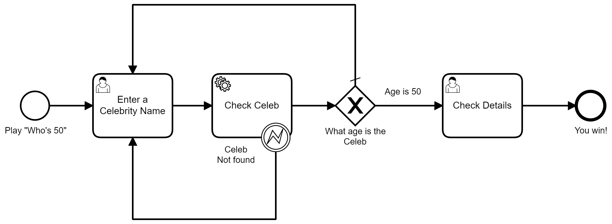

# Who's 50 Game for Camunda Platform 8

To play the game "Who's 50," name someone famous. If they're exactly 50 years old, you win the game! If they're any other age, guess again.

We've turned this game into a Camunda Platform 8 application consisting of three parts: a BPMN 2.0 model, a couple of user forms, and a Java microservice.

You can follow the link below to watch a video stepping through the project.
[](https://youtu.be/oRzpTUN2l6I)

## Prerequisites

To use this project, ensure you have the following requirements:

### Camunda Cloud account

Visit camunda.io and create a Camunda Cloud account. You'll also need to create a cluster and set up client connection credentials. [Follow this tutorial](https://docs.camunda.io/docs/guides/getting-started/) for guidance, and note that you can only have one cluster at a time.

### Camunda Desktop Modeler (optional)

Download [Camunda Desktop Modeler](https://camunda.com/download/modeler/) for all the usual platforms.

### Celebrity Ninjas API key

Create a free account on [Celebrity Ninjas](https://celebrityninjas.com/) and generate an API key. Save this API key so you can apply it to your project in the steps ahead.

### Cloned repository

Clone this repository and open it in an integrated development environment (IDE) like Visual Studio Code, Atom, Eclipse, etc.

## Utilizing the microservice

Much of this project is based on the microservice that queries an API with the name of a celebrity and returns the age of that celebrity.

Set up this microservice by taking the steps below:

1. Navigate to your preferred IDE and open the cloned repository.
2. Within the repo, open up the `application.yml` file in `src/main/resources/`.
3. Add your generated Celebrity Ninjas API key to the designated line in `applications.yml`.
```yaml
celebrityninjas:
  key: YourKeyGoesHere
```
4. Add your Camunda Cloud API details to the `application.yaml` file. Follow our guidance on [getting the API details](https://docs.camunda.io/docs/guides/getting-started/setup-client-connection-credentials/) for assistance.
5. Save your updated `application.yml` file.
6. Start up the worker by running the `worker` class. In this case, you can likely right-click `Worker.java` and select **Run Java**.

## BPMN model

The BPMN model below represents the executable process to play "Who's 50."



Take the following steps to start and deploy this process:

1. Log in to your Camunda Cloud account.
2. Click the **Diagrams** tab.
3. Click **Create New Diagram**.
4. Next to the **New Diagram**, select the three vertical dots and click **Import New Diagram** to upload the model referenced above.
5. Select the `Who's 50 Game` process from the `BPMNandForms` folder.
6. Click **Execute** on the top right side of the page.

Now you've deployed your process and started a process instance.

## Play the game

To play "Who's 50," take the following steps:

1. In Camunda Cloud, navigate to the **Clusters** tab and select your cluster.
2. Click on the **Applications** tab, and open Tasklist by clicking **View User Tasks**.
3. You'll see a task named **Enter a Celebrity Name**. Click on the task and click **Claim** to claim it.
4. In the **Cele Name** field, enter a celebrity name who you believe to be 50 years old and click **Complete Task**.
5. On the left side of Tasklist, filter by **Completed** tasks to view your system message. This message will give you the age of your celebrity and tell you if you've won the game!

## Additional information

To learn more about your instance history and study the execution of your process(es), navigate back to the **Applications** tab within your cluster, and click **View Process Instances** to open up Operate.
